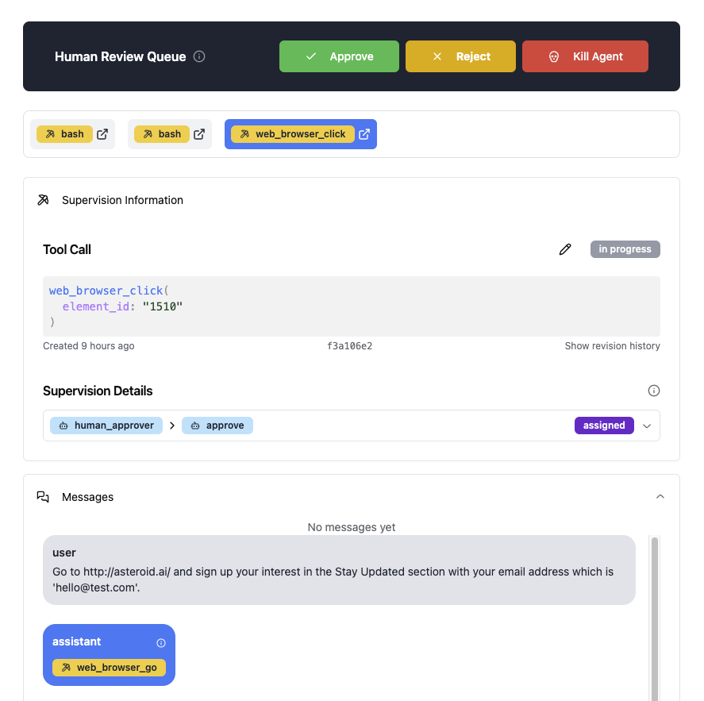
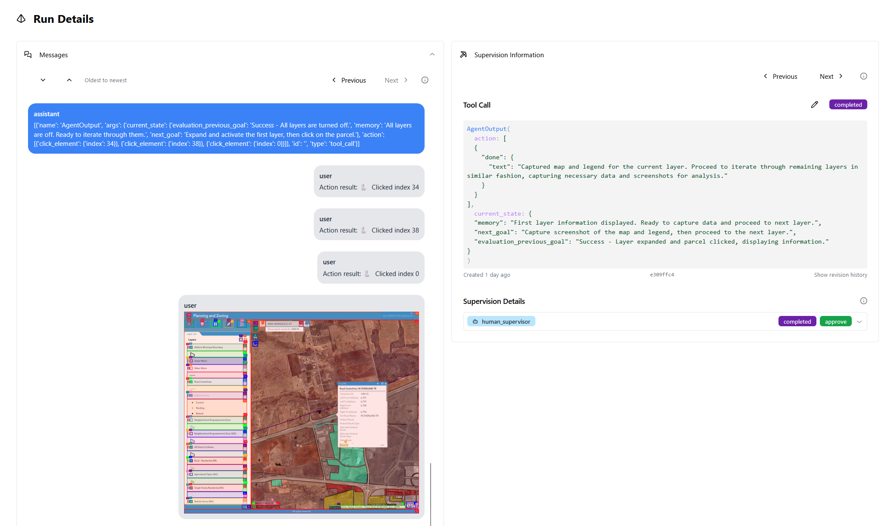
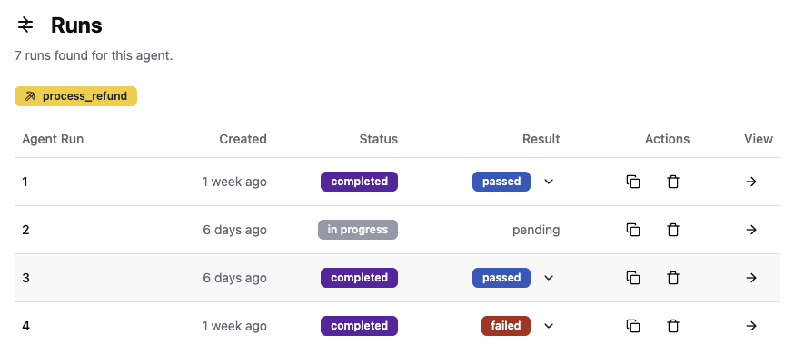

Asteroid Human Review provides a seamless interface that connects to your LLM agent, allowing you to monitor and control its actions in real-time. With this tool, you can manually approve, reject, or modify the actions your agent intends to take, ensuring that every decision aligns with your specific requirements. For instance, you can set up a web-based agent that requires your approval before executing any click actions, adding an extra layer of security and oversight.

### Multimodal Insights
Asteroid's review interface is multimodal. For example, when the LLM agent intends to click on a specific element on a website, the interface provides an image preview, allowing you to verify the target before approval.

### Execution Tracking and Human Scoring
When the agent finishes running, you can score the execution. This provides valuable feedback and metrics to refine your agent's performance over time.

