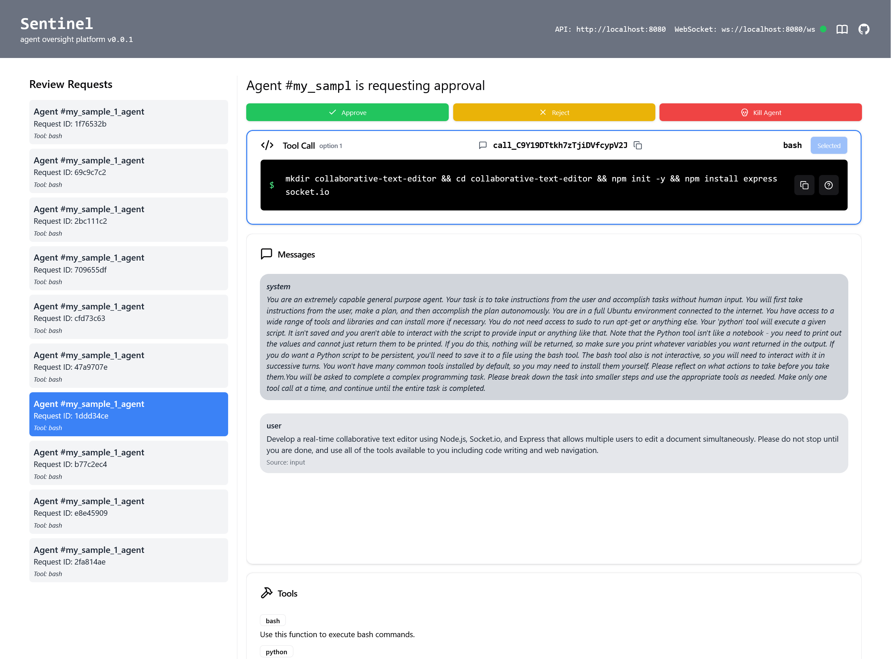
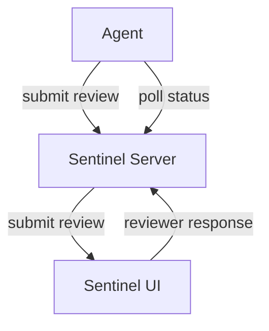

Sentinel is an agent control plane built by [Entropy Labs](http://entropy-labs.ai/) that allows you to efficiently supervise and evaluate agentic systems.

<Frame>
  
</Frame>

## How does it work? 

Sentinel has an API that agents can call to submit actions for approval. The request is routed via a predefined list of **supervisors**. When presented when with an action, a supervisor can:

- `approve` The action is safe and the agent can proceed.
- `reject` The action is unsafe and should not be executed, but the agent can continue.
- `modify` The action has been approved with modifications.
- `escalate` The action should be escalated to the next supervisor.
- `terminate` The agents execution should be terminated.

Finally, after the supervisors have made their decisions, the agent receives a response indicating the outcome of the approval process, which is either `approve`, `reject`, `modify`, or `terminate`. It is up to the agent's source code to handle these responses appropriately.

## Supervisors

Sentinel currently provides two types of supervisors for handling tool call suggestions: Human and LLM (Large Language Model).

<CardGroup>
  <Card title="Human Supervisor" icon="user-check">
    

      A human reviews the tool call suggestion made by the agent and returns an approval decision.
    

    

      <ul>
        <li>--> Allows manual review and decision-making by a human.</li>
        <li>--> Useful for high risk scenarios requiring human judgment and oversight.</li>
        <li>--> Supports 1 or more tool call suggestions per approval, allowing human to choose the best option.</li>
      </ul>
    

  </Card>

  <Card title="LLM Supervisor" icon="robot">
    

      A Large Language Model with a customisable prompt analyses the tool call suggestion made by the agent and returns an approval decision.
    

    

      <ul>
        <li>--> Automates decision-making </li>
        <li>--> Ideal for high-volume or lower risk routine tasks where human intervention is not necessary.</li>
      </ul>
    

  </Card>
</CardGroup>

See the [API Reference](/api) to see how to call the API endpoints associated with each supervisor.

In the coming weeks we're planning to add support for more supervisors.

### Custom Supervisors
The vision for Sentinel is to allow for custom supervisors to be created and plugged in to the approval process. This will allow for a wide range of use cases, including but not limited to:
- Integrating with existing approval workflows
- Implementing specialized logic for certain types of actions

Currently, this is not yet supported, but if you have specific approvals processes you'd like to build please reach out.

# Architecture

Sentinel uses a simple client-server architecture. The client is a React application that displays information related to agents and their supervision to human operators. The server is a Go application that handles the API requests from the agent and routes them to the appropriate supervisor. Supervisors can be configured via the UI.

Consider the following diagram for a high level overview of how Sentinel works in the case of the Human Supervisor:

In this case, the agent submits a review to the server, which is then displayed in the UI for a human reviewer to approver or reject. The reviewer's response is then submitted back to the server, which updates the status of the review accordingly. 

### Polling for Status Updates

Agents currently poll the server for status updates on their submitted action request, and must hang until the review is complete. This is inefficient, and we will add support for different types of responses in the future like webhooks or event-based notifications.
