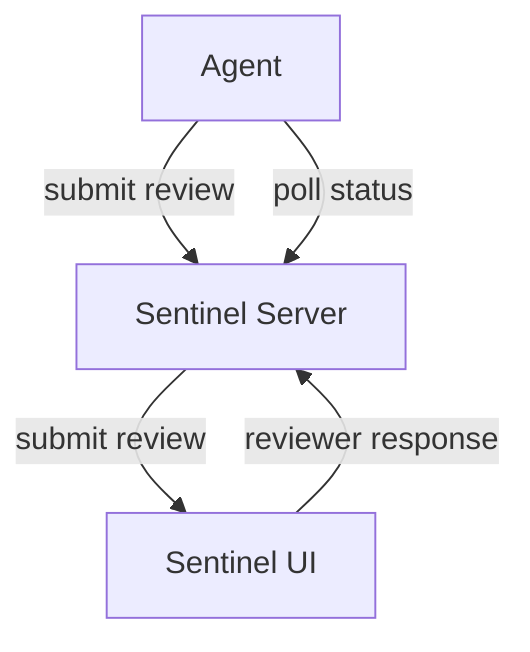

Sentinel is a supervision and evaluation platform for LLM-based systems built by [Entropy Labs](http://entropy-labs.ai/). Sentinel allows you to supervise and evaluate agentic systems during experimentation to quickly iterate on your agent architecture. In production, Sentinel's supervisors can continue to monitor your agent and intervene to correct the agent's actions, terminate the agent or escalate an action to a human reviewer. 

## Sentinel Demo

<iframe
  width="560"
  height="315"
  src="https://www.youtube.com/embed/pOfnYkdLk18?si=xufHV1Rrc7IRn2aq"
  title="Sentinel Demo"
  frameborder="0"
  allow="accelerometer; autoplay; clipboard-write; encrypted-media; gyroscope; picture-in-picture"
  allowfullscreen
></iframe>

## Use Cases

Sentinel is designed to be used in a wide range of use cases to enhance reliability, safety and performance of agentic systems, including but not limited to:

<AccordionGroup>
  <Accordion title="Agent Development">
    Supervise and evaluate agentic systems during experimentation to quickly iterate on your agent architecture.
    - **Tool Call Supervision**: Identify and fix failure modes by supervising tool calls. Supervisors can help you discover failure modes and improve the agent's behaviour.
    - **LLM Response Mocking**: Reuse previous execution logs to mock function responses to test and reproduce results. Simulate LLM responses for unseen scenarios.
    - **Evaluations**: Build and run custom evaluations to score the performance of your agent.
  </Accordion>
  <Accordion title="Agents in Production">
    In production, Sentinel can be used to monitor for undesired behaviour, and can intervene to correct the agent *before* it executes actions that could be problematic.
    - **Tool Call Supervision**: Before the tool call is executed, the agent submits it to a supervisor for approval.
    - **LLM Response Mocking**: Reuse execution logs to mock function responses to test and reproduce results. Simulate LLM responses for unseen scenarios.
    - **Evaluations**: Automatically create evaluations from your agent's execution logs and supervisor's interventions.
 </Accordion>
</AccordionGroup>

## Tool Call Supervisors

Sentinel has an API that agents can call to submit actions for approval. The request is routed via a predefined list of **supervisors**. When presented when with an action, a supervisor can:

- `approve` The action is safe and the agent can proceed.
- `reject` The action is unsafe and should not be executed, but the agent can continue.
- `modify` The action has been approved with modifications.
- `escalate` The action should be escalated to the next supervisor.
- `terminate` The agents execution should be terminated.

Finally, after the supervisors have made their decisions, the agent receives a response indicating the outcome of the approval process, which is either `approve`, `reject`, `modify`, or `terminate`. It is up to the agent's source code to handle these responses appropriately.

### Parallel Supervision Chains
Supervisors can be grouped into **supervision chains** which are executed in parallel. This allows for a fast and efficient approval process, where multiple supervisors can approve or reject an action at the same time. As a dummy example, you can create 2 supervisor chains that are attached to the `send_email()` tool:

**Supervision Chains Example - Send Email**

In this example, both supervisor chains need to approve the action before the agent can proceed. You can configure many more supervisors and chains as you see fit with different policies.
<CardGroup cols={2}>
  <Card title="Chain 1 - Check Email Domains and Content">
    <Steps>
      <Step title="Check Email Domains Supervisor">
        Deterministic Supervisor that only allows emails to be sent to whitelisted domains: `['my-company.com', 'entropy-labs.ai']`
      </Step>
      <Step title="Check Email Content Supervisor">
        LLM Supervisor that checks the email content for sensitive information and ensures it aligns with company policies.
      </Step>
    </Steps>
  </Card>
  <Card title="Chain 2 - Check Email Urgency and Risk">
    <Steps>
      <Step title="Check Email Urgency Supervisor">
        LLM Supervisor that evaluates the urgency and importance of the email based on its content.
      </Step>
      <Step title="Check Email Risk Human Supervisor">
        Human Supervisor to review and approve emails flagged as high-risk or requiring human judgment.
      </Step>
    </Steps>
  </Card>
</CardGroup>

### Supervisor Types
Sentinel currently provides three main types of supervisors for handling tool call supervision: Human, LLM (Large Language Model), and Deterministic. Each supervisor has a different use cases, can be highly customised or you can create completely custom supervisors.

<CardGroup cols={3}>
  <Card title="Human Supervisor" icon="user-check">
    

      A human reviews the tool call suggestion made by the agent and returns an approval decision.
    

    

      <ul>
        <li>--> Allows manual review and decision-making by a human.</li>
        <li>--> Useful for high risk scenarios requiring human judgment and oversight.</li>
        <li>--> Supports 1 or more tool call suggestions per approval, allowing a human to choose the best option.</li>
      </ul>
    

  </Card>

  <Card title="LLM Supervisor" icon="robot">
    

      A Large Language Model with a customisable prompt analyses the tool call suggestion made by the agent and returns an approval decision.
    

    

      <ul>
        <li>--> Automates decision-making </li>
        <li>--> Ideal for high-volume or lower risk routine tasks where human intervention is not necessary.</li>
      </ul>
    

  </Card>

  <Card title="Code Supervisor" icon="code">
    

      A code-based supervisor can run arbitrary code to determine the approval decision. This could be useful for simple approval processes that are known ahead of time, such as whitelisting emails, commands, or URLs, or for more complex approval processes like those requiring custom classifiers or business logic. 
    

  </Card>
</CardGroup>

#### Custom Supervisors
Sentinel allows for custom supervisors to be created and plugged in to the approval process. This allows for a wide range of use cases, including but not limited to:
- Integrating with existing approval workflows
- Implementing specialized logic for certain types of actions

## LLM Response Mocking 
You can reuse previous execution logs to mock function responses, which is useful for testing and reproducing results. When mocking is enabled, the function will not execute its actual logic. Instead, it will behave according to the specified mock policy. You can mock function responses using different `MockPolicy` options.

- **SAMPLE_LIST**: Returns a random element from `mock_responses`.
- **SAMPLE_RANDOM**: Creates a random value matching the return type.
- **SAMPLE_LLM**: Uses an LLM to generate a response.
- **SAMPLE_PREVIOUS_CALLS**: Samples responses from previous executions.

# Architecture

Sentinel uses a simple client-server architecture. The client is a React application that displays information related to agents and their supervision to human operators. The server is a Go application that handles the API requests from the agent and routes them to the appropriate supervisor. Supervisors can be configured via the UI.

Consider the following diagram for a high level overview of how Sentinel works in the case of the Human Supervisor:

In this case, the agent submits a review to the server, which is then displayed in the UI for a human reviewer to approver or reject. The reviewer's response is then submitted back to the server, which updates the status of the review accordingly. 

### Polling for Status Updates

Agents currently poll the server for status updates on their submitted action request, and must hang until the review is complete. If required, we will add support for different types of responses in the future like webhooks or event-based notifications.
