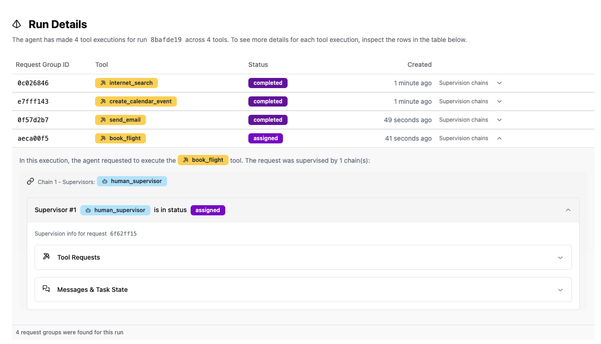
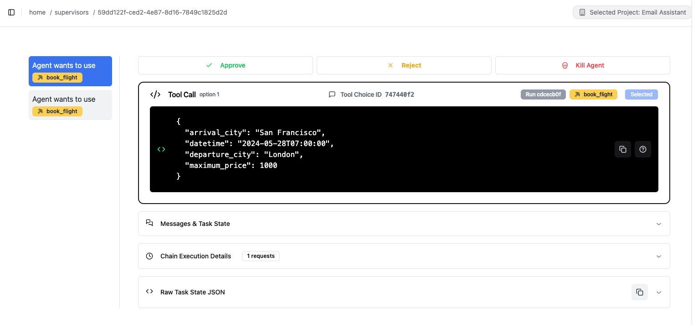

Sentinel can be used with any agent built in Python using the `entropy-labs` Python SDK with Sentinel server and web interface which is hosted locally using Docker.

<Steps>
  <Step title="Install dependencies">
    Install the `entropy-labs` Python SDK and other dependencies:

    ```bash
    pip install entropy-labs
    ```
  </Step>
  <Step title="Clone the repository">
    Clone the Sentinel repository to your local machine and navigate to the project directory:

    ```bash
    git clone https://github.com/EntropyLabsAI/sentinel.git && cd sentinel
    ```
  </Step>
  <Step title="Set up environment">
    Copy the example environment file and set the variables:

    ```bash
    cp .env.example .env
    ```

    Edit the `.env` file to set the appropriate environment variables.
  </Step>
  <Step title="Load environment variables">
    ```bash
    source .env
    ```
  </Step>
  <Step title="Start the server and frontend">
    Use Docker Compose to start both the server and frontend:

    ```bash
    docker compose up
    ```
  </Step>
  <Step title="Access the web interface">
    You can now navigate to `http://localhost:3000` to see the web interface.
  </Step>
  <Step title="Run the example">
    ```bash
    python examples/openai/run.py
    ```
    This will start the example with an AI assistant that can perform tasks like searching the internet, sending emails, creating calendar events, and booking flights. Entropy Labs Supervisors are used to supervise these tool executions. This example is described in more detail below.
  </Step>
  <Step>
    If you prefer using Jupyter notebooks and want to see the example in more detail with explanations, you can run an example in `examples/openai/run.ipynb`.
  </Step>
</Steps>

## Example Agent

In this example, we will demonstrate how to create an AI assistant that can perform tasks such as searching the internet, sending emails, creating calendar events, and booking flights. We will use the `entropy-labs` Python SDK to supervise tool executions with the `supervise()` decorator, ensuring compliance with specified policies or requiring human approval when necessary.

### Overview

The assistant agent is designed to:

- Interact with the user and understand their requests.
- Use tools to perform specific actions like searching the internet or sending emails.
- Utilize the `supervise()` decorator to supervise tool executions.
- Allow supervision and approval of actions in real-time through the Sentinel web interface.

### Key Components

#### 1. **Supervisors**

Supervisors are functions that approve, modify, or escalate tool calls based on certain policies or checks. We define custom supervisors and use built-in ones.

- **`check_email_address_supervisor`**: A custom supervisor that checks if an email address is in a whitelist before sending an email.

```python
def check_email_address_supervisor(whitelisted_emails: List[str]) -> Supervisor:
    def supervisor(
        func: Callable,
        supervision_context: SupervisionContext,
        tool_kwargs: Dict[str, Any],
        **kwargs
    ) -> SupervisionDecision:
        to_email = tool_kwargs.get('to')
        if to_email in whitelisted_emails:
            return SupervisionDecision(
                decision=SupervisionDecisionType.APPROVE,
                explanation=f"The email address '{to_email}' is allowed."
            )
        else:
            return SupervisionDecision(
                decision=SupervisionDecisionType.ESCALATE,
                explanation=f"The email address '{to_email}' is not in the whitelist."
            )
    supervisor.__name__ = check_email_address_supervisor.__name__
    supervisor.supervisor_attributes = {"whitelisted_emails": whitelisted_emails}
    return supervisor
```

- **Built-in Supervisors**: We also use `llm_supervisor` and `human_supervisor` from the `entropy-labs` SDK.

#### 2. **Tools**

We define several tools that the assistant can use. Each tool is supervised to ensure compliance with policies.

- **`internet_search`**: Searches the internet using DuckDuckGo.

```python
@supervise()
def internet_search(query: str, max_results: int = 3) -> str:
    # Function implementation
```

- **`send_email`**: Sends an email, supervised to check recipient and content.

```python
@supervise(supervision_functions=[
    [check_email_address_supervisor(whitelisted_emails=[ENTROPY_LABS_EMAIL])],
    [llm_supervisor(instructions=EMAIL_INVITATION_POLICY), human_supervisor()]
])
def send_email(to: str, subject: str, body: str):
    # Function implementation
```

- **`create_calendar_event`**: Creates a calendar event, supervised to ensure correctness.

```python
@supervise(supervision_functions=[[llm_supervisor(instructions=CORRECT_TOOL_PARAMETERS_POLICY)]])
def create_calendar_event(title: str, start_time: str, end_time: str):
    # Function implementation
```

- **`book_flight`**: Books a flight ticket, always requiring human approval.

```python
@supervise(supervision_functions=[[human_supervisor()]])
def book_flight(departure_city: str, arrival_city: str, datetime: str, maximum_price: float):
    # Function implementation
```

#### 3. **Assistant Agent**

The assistant agent interacts with the user, utilizes the tools, and handles OpenAI responses.

- **Creating OpenAI Tool Definitions**: We convert our tool functions into OpenAI's expected schema.

```python
def create_openai_tool(func: Callable) -> dict:
    # Function implementation
```

- **Chat Function with OpenAI**: Handles interaction with the OpenAI GPT model.

```python
def chat_with_openai(messages: List[Dict], tools: List[Callable]):
    # Function implementation
```

- **Executing Tool Calls**: Executes tool calls as decided by the assistant.

```python
def execute_tool_call(tool_call, tools):
    # Function implementation
```

- **Starting the Chatbot**: The main loop that starts the chatbot and handles user interaction.

```python
def start_chatbot(
    start_prompt: str,
    tools: List[Callable],
    run_id: UUID,
    output_widget: widgets.Output,
    input_widget: widgets.Text
):
    # Function implementation
```

#### 4. **Running the Assistant**

We set up the environment and start the assistant.

```python
# Define the initial prompt for the chatbot
start_prompt = (
    "Go and find the most interesting events happening in AI next week in San Francisco. "
    "Then create a calendar event for the most interesting one. When done, ask me email addresses "
    "where you should send invitations for that event. After the email is sent, book me a flight ticket "
    "from London to San Francisco to attend that event. Make sure that the flight price is less than 1000 GBP."
)

# List of tools available to the assistant
tools = [
    internet_search,
    send_email,
    create_calendar_event,
    book_flight
]

# Register project, task, and run with Entropy Labs
project_id = register_project(
    project_name="Email Assistant",
    entropy_labs_backend_url="http://localhost:8080"
)
task_id = register_task(project_id=project_id, task_name="Email Assistant")
run_id = create_run(project_id=project_id, task_id=task_id, tools=tools)

# Start the chatbot
start_chatbot(start_prompt, tools, run_id, output, input_box)
```

### Supervising the Agent in Real-Time

With the Sentinel web interface running at `http://localhost:3000`, you can supervise the agent's actions in real-time.

1. **Start the Sentinel Server and Frontend**: If you haven't already, start the server:

    ```bash
    docker compose up
    ```

2. **Access the Web Interface**: Navigate to `http://localhost:3000` in your browser.

3. **Monitor Runs**: Click on **Projects**, select the **Email Assistant** project, and open the latest run.

4. **Approve or Reject Actions**: You will see function calls, approvals, and escalations. For actions requiring approval, such as sending emails to unlisted addresses or booking flights, you can approve or reject the actions.


*Pending approval for a flight booking request.*



*Approving or rejecting the flight booking request.*

### Conclusion

By using the `supervise()` decorator and Sentinel, we can ensure that our AI assistant operates within predefined policies and allows for human oversight when necessary. This example demonstrates how to integrate supervised tool executions into an AI assistant, enhancing safety and reliability.

---

## More Examples

<AccordionGroup>
  <Accordion icon="rectangle-terminal" title="Inspect">
    <Info>
      Steps to run the Inspect example are at [Inspect AI](/inspect-AI).
    </Info>
  </Accordion>
</AccordionGroup>